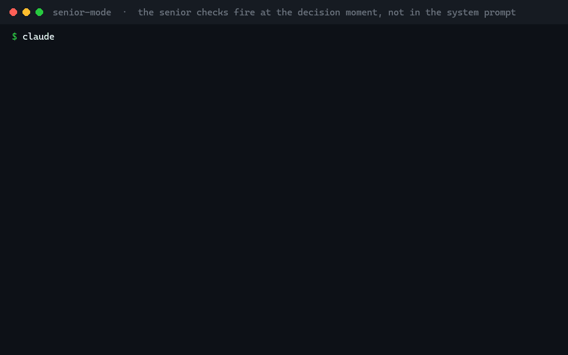
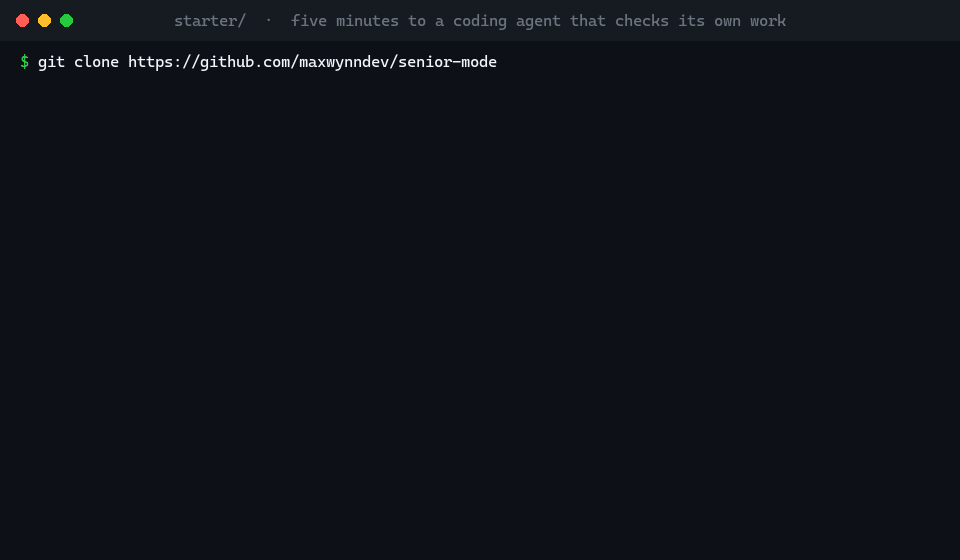
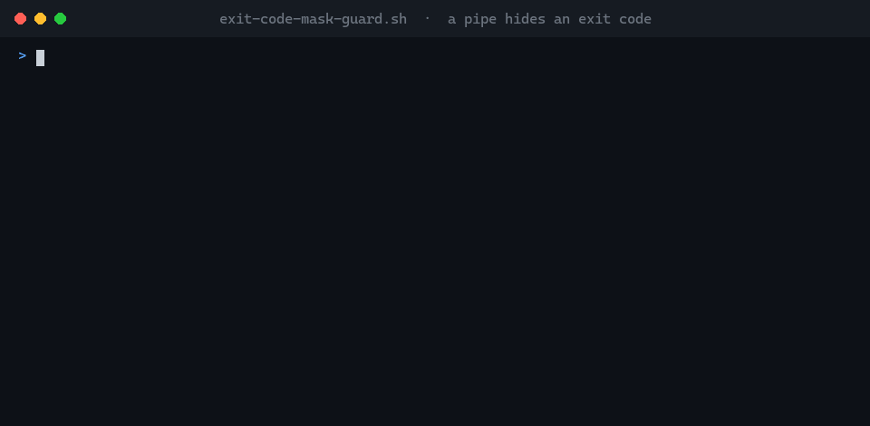
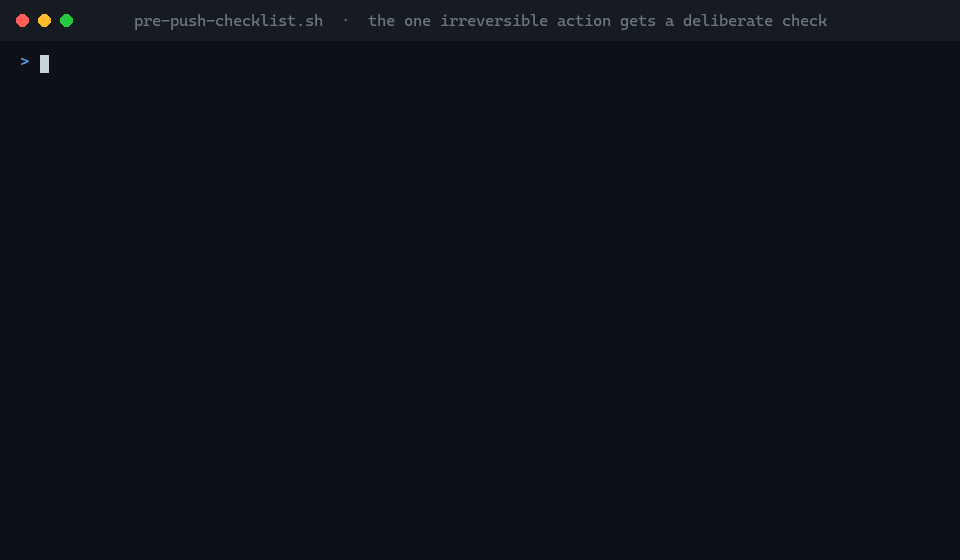
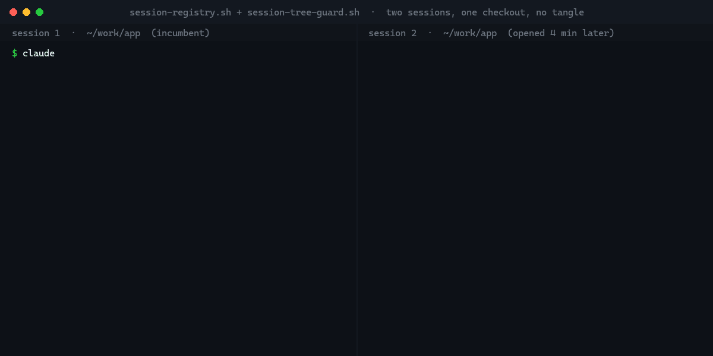
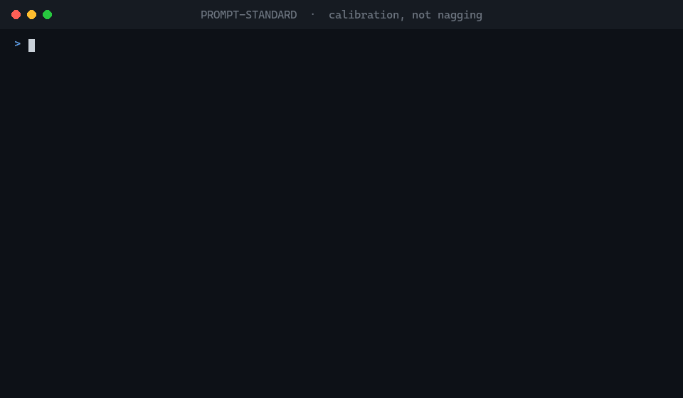

# senior-mode

**`"use strict"` for coding agents.** Make the agent fail its own review
before you see the answer.

One setup that makes a coding agent behave like a senior engineer, for
whichever agent you use: hooks that fire a checklist at the moment of
decision, commit and push gates that refuse half-done work, a doctrine of
how a green check lies to you, path-scoped rules, specialist reviewers,
and a memory of how you like to work. One source of truth in the repo,
generated wiring per agent, a stack profile picked from evidence.

Adapters for **Claude Code, Codex CLI, Cursor, Gemini CLI, GitHub
Copilot, OpenCode, Factory Droid, Devin CLI, and Augment** (hooks and
all), and `AGENTS.md` for anything else (Windsurf, Kiro, Amp, Zed,
Warp, Jules, Junie, Cline) carrying the doctrine, rules, and procedures.
Any stack; a fresh repo or one that is already set up. See "What is
verified" below before you trust a claim.

[](https://github.com/maxwynndev/senior-mode/actions/workflows/hooks.yml)




<sub>Rendered walkthrough (`docs/make-gifs.py`, same for every GIF on
this page). Agents do not display hook-injected context in their UI, so a
screen recording cannot show the hooks firing; the banner text is
verbatim from the hook scripts.</sub>

---

## Two ways in

### 1. The 5-minute version (`starter/`)

Installs globally under your agent's home directory, so it applies in
every repo with no per-project work. Nothing touches git or deploys.

```bash
git clone https://github.com/maxwynndev/senior-mode
bash senior-mode/starter/install.sh                 # Claude Code (default)
bash senior-mode/starter/install.sh --agent codex   # or codex, cursor, gemini, copilot, opencode, all
```

You get the behavioral core (ask when ambiguous, evidence before the
first edit, never cite an unread source, one-pass thoroughness, never
weaken a test to get green), the two senior-check hooks, the doctrine,
the prompting guide, and `/review`.



### 2. The full kit (repo root)

For a project you ship from. Adds commit and push gates, parallel-session
safety, six review subagents, fifteen procedures, a multi-agent audit
workflow, auto-formatting, and a stack profile picked from the repo.

```bash
bash senior-mode/install.sh --dry-run /path/to/your-repo      # see what would happen, for the agents it finds
bash senior-mode/install.sh /path/to/your-repo                # install for the agents it finds; stack detected from manifests
bash senior-mode/install.sh --agent claude,cursor --stack python-fastapi-postgres /path/to/your-repo
bash senior-mode/install.sh --list-stacks                     # the stack picker
```

Then open your agent in the repo and paste `.senior-mode/KICKOFF-PROMPT.md`.
It verifies the hooks, confirms or picks the stack (with the evidence),
fills in the placeholders with you, and merges anything the installer
would not overwrite. Full walk-through: `START-HERE.md`, then `SETUP.md`.

---

## How one kit fits every agent

```
AGENTS.md                 the universal entry point: posture, rules table, procedures, stack
CLAUDE.md                 "@AGENTS.md" plus Claude Code notes (Claude does not read AGENTS.md itself)
.senior-mode/             the source of truth
  hooks/                  bash scripts speaking the Claude Code hook JSON contract
  rules/  reviewers/  commands/  memory/  stacks/<profile>/
.agents/skills/           the procedures as Agent Skills (read by most agents)
.claude/ .codex/ .cursor/ .gemini/ .github/ .opencode/ ...   generated wiring, one adapter each
```

The hook contract (`tool_input.command` in, `permissionDecision` out) is
spoken natively by Claude Code, Codex, Copilot, Factory, Devin, Augment,
and Junie; Cursor and Gemini get a 60-line shim; OpenCode gets a plugin
that runs the same scripts. `adapters/README.md` has the full capability
matrix, including what each agent cannot do (Cursor cannot inject context
on prompt submit, Gemini cannot block-and-re-prompt at turn end) and how
the kit degrades there.

## Why this is different

Most agent configs are a rules file that says "be a senior engineer."
The model reads it, agrees, and then ships the convenient reading of your
directive anyway. The rule was recalled; it was not applied. This kit is
built around closing that gap.

**The checklist fires at the decision moment, not in the system prompt.**
A prompt-submit hook injects the senior checklist as each prompt arrives
(is this ambiguous? what is the 100% version? what evidence confirms the
diagnosis?). A stop hook blocks the response once per turn with the
after-checklist (did you cut a corner? would a senior push back? could
your green have gone red?). The agent fixes it before you see it. The
hooks are fail-open and can never loop.

**A green check that cannot fail proves nothing.** Section 19 of
`ENGINEERING-PRINCIPLES.md` is a catalogue of the ways a review lies to
itself, each of which cost a real team real hours more than once: the
test no runner imports, the suite that reports "0 failed" because 0 ran,
the `| tail` that replaced the exit code, the grep that matched the marker
you wrote yourself, the fix that was right for a false reason.
`exit-code-mask-guard.sh` exists because a piped CI watcher reported red
runs as green five times in two months on one project.



**The gates read the repo you are actually in.** `git push` is denied
unless HEAD carries a `Senior-Checklist:` trailer with five graded keys
(ambiguity, summary, concurrency, regression, blast). A commit is denied
for a bare `TODO`, a print-debug line in a prod path, or a new source
file over 400 lines without a stated exception. Both validate the repo
the command runs from, so they work from worktrees, under any agent.



**Parallel sessions do not tangle.** A session registry knows who else is
live in your checkout, whichever agent they are running. The first
session is the incumbent; a second one in the same tree is steered to a
worktree and blocked from committing until it isolates.



**The stack is picked from evidence.** `stacks/detect.sh` scores every
profile's signals against the manifests and prints the ranked evidence;
a confident match installs, anything weaker goes to a picker the agent
walks through with you. Seven profiles ship (Next.js + Vercel + Postgres,
Node API, FastAPI, Django, Rails, Go, Rust), each with real commands in
`profile.json` so the agent never guesses how to run tests or migrate.

**Briefing enforcement is calibrated, not nagging.** A question passes
straight through. A vague build prompt ("make the dashboard better")
stops once, names the missing elements, offers a best guess, and waits.
A complete brief runs to its stop condition without check-ins.



**The hooks are tested.** `bash core/hooks/test-checklist.sh` runs the
harness against scratch git repos: every deny and allow path, the
worktree case, the loop backstop, both shims in both directions, the
detector's verdicts, and a real install. It runs in CI on Linux, macOS,
and Windows on every push. Nobody tests their hooks. These are tested.

**Evidence before code, visibly.** Before a non-trivial edit, the agent
leads with a `[BEFORE-AUDIT]` block: diagnosis and the evidence it rests
on, what is missing, the 100% version, the 80% gap, what a senior would
reject. A post-hoc confession is not an audit.

---

## What is verified, and what is not

Plainly, so nobody has to find out the hard way:

- **Run end to end here:** Claude Code 2.1.241 and Codex CLI 0.146.0
  (Codex's hook file format was checked against a live `~/.codex/hooks.json`).
  The harness (63 cases, 65 where bun is installed) runs on every push on
  Linux, macOS, and Windows.
- **Validated against official docs and the harness, not inside the
  agent:** the Cursor and Gemini shims (payloads in both directions are
  tested against the real hook scripts), the Copilot, OpenCode, Factory,
  Devin, and Augment adapters (generated files parse; formats follow the
  docs as of August 2026). If you run one of those, the first prompt
  tells you whether the check arrived; an issue with the payload you saw
  is the most useful contribution you can make.
- **Instruction only:** every agent that reads `AGENTS.md` but has no
  hook contract this kit can verify. There the checks are asked for, not
  enforced.
- **The hooks are prompts, not guarantees.** A senior-check is text the
  model reads at the right moment; the commit and push gates are the
  only mechanical blocks. Models still ship the convenient reading
  sometimes. The kit makes that rarer and more visible, not impossible.

---

## What's in the box

```
senior-mode/
  starter/                   the 5-minute global install, per agent
  README.md  START-HERE.md  SETUP.md  KICKOFF-PROMPT.md  STACK.md  CHANGELOG.md
  CONTRIBUTING.md  SECURITY.md
  install.sh                 --agent, --stack, --dry-run, --force, --list-stacks
  AGENTS.md / CLAUDE.md      this repo's own instructions (it runs its own kit;
                             the templates that ship to users are in core/)
  ENGINEERING-PRINCIPLES.md  never/always lists, money/PII/tenant invariants, LOC budget, refactor tiers, verification craft
  PROMPT-STANDARD.md         the 5-element brief, verification loops, context hygiene
  PROMPTING.md               writing LLM system prompts (rubric, evals)
  WORKFLOW.md                deploy pipeline template (two verification models)

  core/                      the source of truth
    AGENTS.md  CLAUDE.md    the entry-point templates installed into your repo
    hooks/                   9 wired, 2 optional, 1 test harness
    rules/                   5 stack-neutral path rules
    reviewers/               6 briefs: 5 read-only reviewers + 1 app verifier
    commands/                15 procedures
    memory/                  working-style preferences that travel with you

  adapters/                  one generator per agent + the Cursor and Gemini shims + the capability matrix
  stacks/                    detect.sh, README.md (the picker), 7 profiles
    nextjs-vercel-postgres/  the reference web-app profile, with the QA pack
    node-api-postgres/  python-fastapi-postgres/  django-postgres/  rails-postgres/  go-service/  rust-service/
  docs/                      the GIFs and their generator
```

---

## Opinions you will want to argue with

Extracted from a working production setup, and opinionated. Every one of
these is a file or a line you can delete.

- **Push to the deploy branch, no PRs.** Safety lives in CI, the deploy
  gate, and rollback. `WORKFLOW.md` ships a PR-based model too; pick one.
- **The push gate wants a commit trailer.** It forces a 10-second
  self-check before the one irreversible action. Remove the hook if you
  hate it.
- **The after-check costs one extra short model round per turn** where
  the agent supports it. Delete that event from the generated wiring if
  it is not worth it to you.
- **400 lines per new file.** Enforced at commit. Raise the number in
  `pre-commit-audit.sh`, or add the exception comment.
- **Thoroughness over token thrift.** The doctrine says spend what the
  task warrants. Soften it in `AGENTS.md` if your budget disagrees.
- **The memory bundle assumes you trust the agent with operational CLIs**
  once confirmed per project. Delete `feedback_cli_authority.md` if not.

---

## Requirements

- Any of the agents above.
- `bash` on PATH (Git Bash on Windows; the hooks are bash scripts and run
  on macOS, Linux, and Windows).
- `git`.
- Optional: `node` for JSON validation in the harness; `ANTHROPIC_API_KEY`
  for the counterfactual verifier hook.

## Contributing

Run the harness before and after touching anything under `core/` or
`adapters/`:

```bash
bash core/hooks/test-checklist.sh
```

An adapter is one bash script (`adapters/README.md` explains the contract);
a stack profile is a folder (`stacks/README.md`). Both are good pull
requests. See `CHANGELOG.md` for what moved when and why.

## License

MIT.
